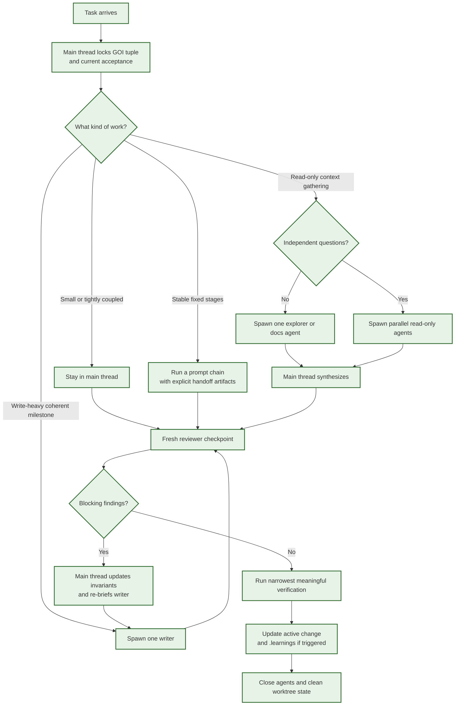

# Multi-Agent Execution

Status: canonical starting pattern
Last updated: 2026-05-08

## Purpose

This document records the current repo-default way to use multiple agents in a
repository that adopts this template.

It is an operating guide, not a new control plane.

It does **not** replace:

- `gstack`
- `OpenSpec`
- the active change
- `.learnings/`

## Inputs And Grounding

This guide is a repo-local synthesis built from:

- repo-local practice notes
- Anthropic's official agent-pattern material for sequential, hierarchical,
  parallel, and evaluator-optimizer workflows
- Claude Code docs for subagents, parallel research, chaining, and agent teams
- OpenAI's official agent guidance and Codex workflow examples
- the official `openai/skills` GitHub repository for repeatable workflow skills

Inference note:

- Anthropic publishes a close pattern taxonomy directly.
- OpenAI/Codex currently publishes workflow examples and orchestration guidance
  rather than the exact same five labels.
- The Codex mapping below is therefore inferred from official Codex use cases,
  workflow guidance, and skills packaging examples.

## Pattern Summary

| Pattern | Repo disposition | Best fit in this repo | Avoid when |
| --- | --- | --- | --- |
| Prompt chaining | Situational | Stable stage-gated pipelines where every handoff has an explicit artifact or decision gate | The task needs repeated backtracking, shared live context, or one agent can do it cleanly |
| Routing | Default at intake | The main thread decides whether work stays local, goes to read-only exploration, enters one-writer implementation, or needs an exceptional branch | Routing starts to behave like a persistent orchestration runtime rather than a bounded intake decision |
| Parallelization | Situational | Independent read-only exploration, independent review, or disjoint write worktrees with explicit ownership | Agents need to edit the same files, share mutable state, or build on each other's outputs in sequence |
| Orchestrator-workers | Default for non-trivial write-heavy slices | Main thread holds requirements and integration; one writer owns the current milestone; reviewer checks a checkpoint | The task is tiny, tightly coupled, or not scoped well enough for delegation |
| Evaluator-optimizer | Checkpoint-only | Review, test, metric, and smoke loops with explicit acceptance criteria | The rubric is vague, the loop is expensive, or model-on-model critique replaces executable checks |

## Repo Defaults

- The main thread owns the GOI tuple, invariants, acceptance, integration, and
  final decisions.
- One writer is the default for one coherent milestone.
- One fresh read-only reviewer is spawned per checkpoint, then closed.
- Explorer/docs agents are on-demand and usually read-only.
- Parallel writers are exceptional and require separate worktrees, disjoint
  write sets, and explicit ownership.
- Evaluator loops stay bounded by explicit acceptance and executable checks,
  not open-ended taste iteration.
- Delegation-heavy or parallel-dispatch modes are opt-in and should be started
  only after the user confirms the launch.

## Canonical Graph

## Five Patterns In This Repo

### Prompt chaining

Use prompt chaining when the task naturally decomposes into fixed stages with
clear linear dependencies.

Good fits in this repo:

- fact gathering -> proposal/design/tasks -> implementation
- export -> smoke -> report
- compare -> validate -> wiki-ready markdown

Guardrails:

- every step should produce a concrete handoff artifact, decision, or failure
  gate
- do not force a chain when the task mainly needs shared context or repeated
  iteration

### Routing

Routing is the repo-default intake pattern.

The main thread decides early whether the task should:

- stay in the main thread
- use a read-only explorer/docs agent
- enter the default one-writer implementation path
- use an exceptional disjoint parallel branch

Guardrails:

- route once based on the real blocker and acceptance surface
- do not turn routing into a standing task ledger or a second workflow graph

### Parallelization

Use parallelization only when subtasks are genuinely independent.

Good fits in this repo:

- read-only context gathering across different code or doc areas
- multiple independent reviews on a bounded diff
- separate worktrees with disjoint write sets and explicit ownership

Bad fits in this repo:

- overlapping file edits
- shared mutable outputs
- steps where one worker's result is needed before the other can proceed

#### Parallel dispatch checklist

Before starting parallel writers, verify all of the following:

- write sets are disjoint
- each writer has a separate worktree
- the main thread is not blocked on both results simultaneously
- integration ownership is explicit

If any item fails, do not start parallel writers. Use one writer plus read-only
explorers or reviewers instead.

### Orchestrator-workers

This is the repo-default pattern for non-trivial write-heavy slices.

Default shape:

- main thread keeps requirements, invariants, boundaries, and integration
- one writer owns one coherent milestone
- one fresh reviewer audits each checkpoint
- explorer/docs agents are attached on demand and then closed

This is the practical interpretation of the repo's current quality-first rule:
prefer one bounded writer over a standing team unless the write sets are already
cleanly separable.

#### Optional launch gate

Use the default one-writer shape automatically only when the work is already
inside the repo's accepted local execution posture.

When the workflow is about to start a more explicit delegation-heavy mode, ask the user before launch and confirm:

- the active acceptance source is concrete
- the task packet is concrete
- the user wants that launch shape now

If any of those are missing, keep the work in the main thread.

### Evaluator-optimizer

Use evaluator-optimizer only when the evaluation rubric is explicit and the loop
is worth the cost.

Good fits in this repo:

- reviewer findings classified as `blocking / important / low`
- metric validation against a defined contract
- smoke or artifact checks with clear pass/fail outcomes

Avoid-by-default when:

- the loop is only taste-based
- the repo already has a cheaper executable check
- the agent would critique itself without a stable rubric

In this repo, evaluator loops are checkpoint tools, not the main execution
mode.

## Canonical Starting Point

For most non-trivial repo work, start here:

1. Main thread locks the GOI tuple and the active acceptance surface.
2. Route the task.
3. If the task is write-heavy, use `orchestrator-workers` with one writer.
4. If the task only needs context, use one or more read-only agents.
5. If the task has fixed stage gates, run a prompt chain inside that bounded
   path.
6. Use evaluator checkpoints only when criteria are explicit.
7. If a delegation-heavy or parallel-dispatch launch is recommended, ask the
   user before starting it.
8. Close agents when the milestone or checkpoint ends.

## Sources

- Anthropic: [Building Effective AI Agents](https://resources.anthropic.com/building-effective-ai-agents)
- Anthropic PDF: [Architecture Patterns and Implementation Frameworks](https://resources.anthropic.com/hubfs/Building%20Effective%20AI%20Agents-%20Architecture%20Patterns%20and%20Implementation%20Frameworks.pdf)
- Claude Code: [Create custom subagents](https://code.claude.com/docs/en/sub-agents)
- Claude Code: [Run agent teams](https://code.claude.com/docs/en/agent-teams)
- Claude prompt engineering: [Chain complex prompts for stronger performance](https://docs.anthropic.com/en/docs/build-with-claude/prompt-engineering/chain-prompts)
- OpenAI: [A practical guide to building agents](https://openai.com/business/guides-and-resources/a-practical-guide-to-building-ai-agents/)
- OpenAI Codex: [Use cases](https://developers.openai.com/codex/use-cases)
- OpenAI: [Introducing Codex](https://openai.com/index/introducing-codex/)
- GitHub: [openai/skills](https://github.com/openai/skills)
